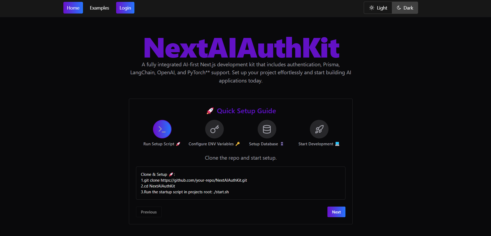
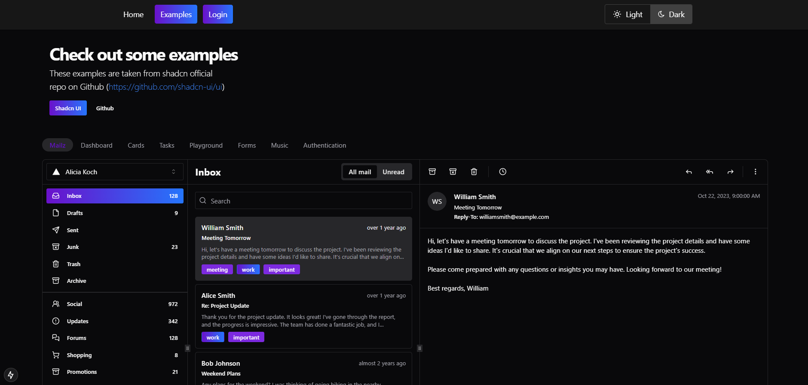

### Next AI Auth Kit (shadcn) 

> [[Click Here For Live Demo](https://nextaiauthkit.vercel.app/)]

Welcome to the **NextAI Auth Kit** repository! This advanced starter kit is designed for **AI-powered applications** built using **Next.js 15**, **React 19**, **TypeScript 5**, **Shadcn UI**, **Tailwind CSS**, and comes pre-integrated with **authentication, AI models, and database support**. This template is aimed at streamlining **AI application development** by integrating **FastAPI, LangChain, PyTorch, Prisma, and NextAuth.js**.






## 🚀 Features

- **Next.js 15 (Stable) with App Router**
- **React 19 (RC) with Suspense and Server Actions**
- **TypeScript 5** for robust type safety
- **Shadcn UI** for an elegant component library
- **Tailwind CSS 3** for rapid styling
- **System, Light & Dark Mode with Theme Switching**
- **Authentication via NextAuth.js** (Google & GitHub OAuth, Role-Based Access)
- **Full Prisma ORM Integration** (User, Admin, and Role-Based Permissions)
- **Database Support** (SQLite, PostgreSQL, MySQL)
- **AI Integrations**:
  - **LangChain** for LLM-based workflows
  - **FastAPI** as an optional backend for AI services
  - **PyTorch** integration for deep learning applications
- **Custom MDX Markdown & Syntax Highlighting**
- **React Charts, Excalidraw & Advanced UI Components**
- **Prettier & ESLint for Clean Code**
- **Dockerfile for Containerized Deployment**

## 🏁 Quick Start

### Prerequisites

- **Node.js**: Version 20.18.0 or higher
- **Docker**: For containerized deployment (optional but recommended)
- 
### 1️⃣ Clone the Repository
```bash
  git clone https://github.com/your-repo/NextAIAuthKit.git
  cd NextAIAuthKit
```

### 2️⃣ Run Setup Script 🚀
```bash
  ./start.sh
```
This script automates:
- Installing dependencies
- Setting up the database with Prisma
- Configuring authentication providers
- Initializing AI and API integrations

### 3️⃣ Follow Instructions on **http://localhost:1880**
Once the script completes, follow the on-screen steps to finalize your setup.

## 🛠️ Configuration & Environment Setup

### 📌 Set up API Keys (Required for AI Features & Authentication)

```bash
  OPENAI_API_KEY=your_openai_key
  GOOGLE_CLIENT_ID=your_google_client_id
  GOOGLE_CLIENT_SECRET=your_google_client_secret
  ANTHROPIC_API_KEY=your_anthropic_key
```

### 📌 Setup Database & Migrations
```bash
  npx prisma init
  npx prisma migrate dev
```

### 📌 Start Development Server 💻
```bash
  npm run dev
```
Your application will now be running at **http://localhost:3000**

## 📦 Integrations & Technologies

### 🔹 Authentication & User Management
- **NextAuth.js** for OAuth & Role-Based Access
- **Google & GitHub SSO** included by default
- **Admin & User Roles Preconfigured**

### 🔹 AI & Machine Learning
- **LangChain** for LLM-powered AI workflows
- **PyTorch** for deep learning model execution
- **FastAPI Backend** for scalable AI processing

### 🔹 UI & Theming
- **Shadcn UI Components** for seamless UI development
- **Framer Motion** for animations
- **Dark Mode & System Theming**

### 🔹 DevOps & Deployment
- **Dockerfile for Production Deployment**
- **Next.js Bundle Analyzer**


### 🐳 Docker Setup

To use Docker, make sure Docker is installed on your machine. Then, build and run the Docker container:

```bash
docker build -t nextjs-starter .
docker run -p 1880:3000 nextjs-starter
```
## ☁️ Try it in the Cloud

[](https://vscode.dev/github/SiddharthaMaity/nextjs-15-starter-shadcn)

[](https://github.com/codespaces/new?hide_repo_select=true&ref=main&repo=SiddharthaMaity/nextjs-15-starter-shadcn)

[](https://codesandbox.io/s/github.com/shaungt1/NextAuthKit)

[](https://gitpod.io/#https://github.com/github.com/shaungt1/NextAuthKit)

[](https://stackblitz.com/github/github.com/shaungt1/NextAuthKit)

[](https://replit.com/github/shaungt1/NextAuthKit)

[](https://glitch.com/edit/#!/import/)

### License

This project is licensed under the MIT License. See the [LICENSE](LICENSE) file for details.


