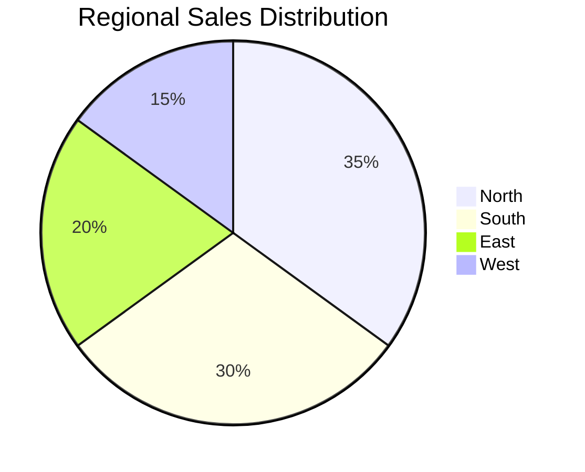

# Monthly Sales Overview Report

## Executive Summary

This monthly sales report provides a detailed analysis of our sales performance, market trends, and key opportunities for growth.

### Sales Highlights

| Category | Current Month | Previous Month | YoY Change |
|----------|--------------|----------------|------------|
| Total Sales | $850K | $780K | +9% |
| New Customers | 145 | 120 | +20.8% |
| Average Order Value | $2,850 | $2,600 | +9.6% |

## Market Analysis

### Top Performing Products

1. Product A: $250K (29.4% of total sales)
2. Product B: $180K (21.2% of total sales)
3. Product C: $150K (17.6% of total sales)

### Regional Performance

## Growth Opportunities

### Emerging Markets
- Asia Pacific region showing 25% growth potential
- European market expansion opportunities
- Latin American market entry planning

### Product Development
1. New feature requests from top clients
2. Competitive analysis findings
3. Technology trend alignment

## Action Items

1. **Immediate Actions**
   - Launch Q2 promotion campaign
   - Implement new sales training program
   - Optimize pricing strategy

2. **Medium-term Plans**
   - Develop new product features
   - Expand sales team
   - Enhance CRM capabilities

## Forecast

| Quarter | Projected Sales | Growth Target |
|---------|----------------|---------------|
| Q2 2024 | $2.8M | +15% |
| Q3 2024 | $3.2M | +14% |
| Q4 2024 | $3.6M | +12% |